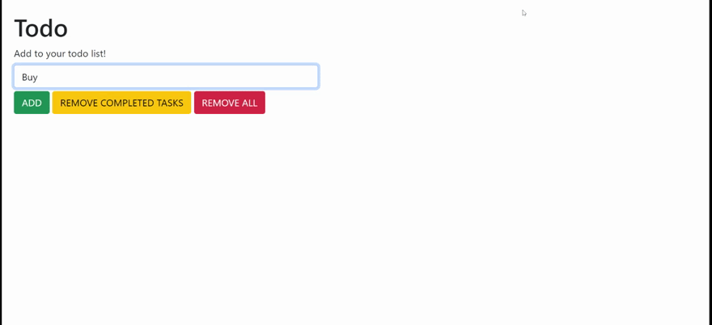

# To Do: DOM

> In this assignment, we'll be creating a to do list... from scratch! 
> 
> Feel free to take creative liberties with the design and user interface of your application.

## An example finished product

## Requirements

* Users have the ability to add new to-do items
* Users have the ability to view to-do items
* Allow users to clear all to-do items
* Users have the ability to toggle the completion of to-do items
* Allow users to delete individual to-do items

## Stretch goals

* Allow users to edit existing to-do items
* Remove Completed Tasks

## Extra Stretch goals

* Move completed tasks to a different section in addition to adding the strikethrough
* Implement a Category system for your todo Items
* Todo Items should also have a due Date

